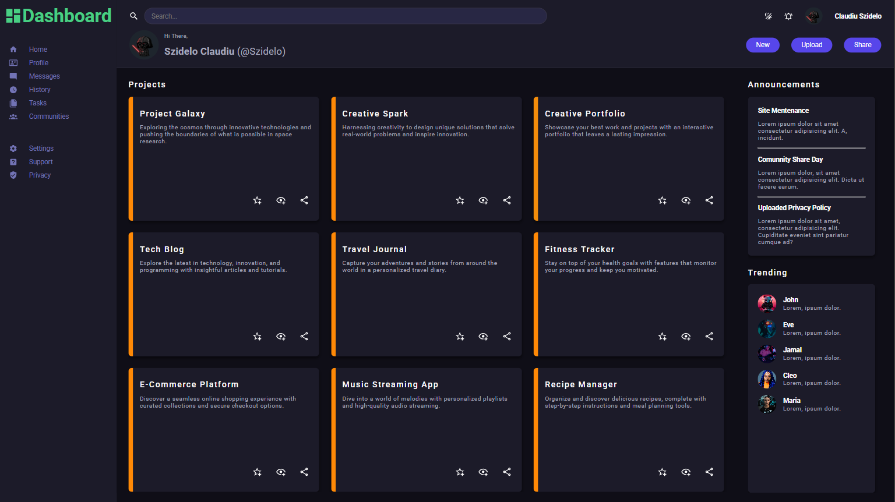
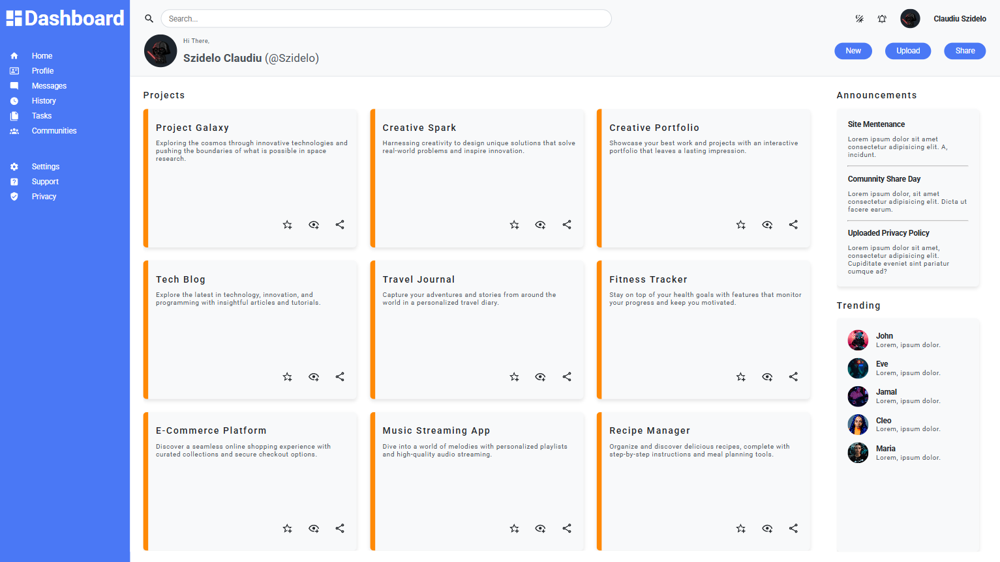
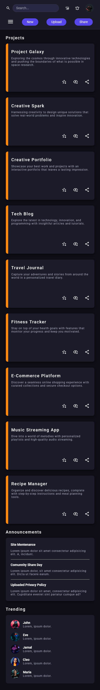
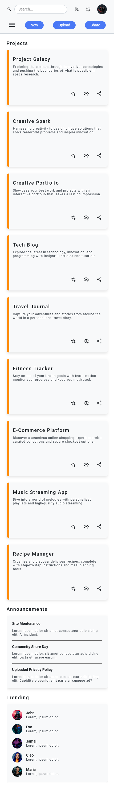

# Odin Dashboard

---

## Live Demo

[**Try the Odin-Dashboard Page Here**](https://szidelo.github.io/odin-dashboard/)

---

## Screenshots

### Desktop Dark-Theme View



### Desktop Light-Theme View



### Mobile Dark-Theme View



### Mobile Light-Theme View



---

## Features

1. **Dark Theme**

    - A theme button that allows users to toggle between dark and light modes.
    - Saves the selected theme to localStorage, ensuring user preferences persist across sessions.
    - Applies a visually appealing and accessible color scheme for both light and dark modes.

2. **Grid and Flexbox Layout**

    - Utilizes a combination of CSS Grid and Flexbox for a seamless and dynamic layout.
    - Ensures efficient use of space and optimal alignment of elements for both small and large screens.
    - Input fields dynamically highlight their corresponding labels on focus, improving accessibility and user experience.

3. **Responsive**

    - Fully responsive design adapts the layout for various screen sizes, from mobile to desktop.

4. **Sidebar Toggle**

    - A collapsible sidebar that can be toggled open or closed using a button.
    - Prevents page scrolling when the sidebar is active for a seamless user experience.
    - Smooth animations enhance the interaction for opening and closing the sidebar.

---

## Technologies Used

-   **HTML5**:  
    Provides the semantic structure for the web page, organizing content into meaningful sections.

-   **CSS3**:

    -   Enhances the layout using a combination of **Grid** and **Flexbox** for a responsive and adaptable design.
    -   Includes styling for interactivity, and a visually appealing theme.

-   **JavaScript**:
    -   Implements a **Dark Theme Toggle**:
        -   Allows users to switch between light and dark themes.
        -   Saves the user's theme preference to `localStorage` for persistence across sessions.
        -   Dynamically applies the theme to the `body` element based on saved preferences or user actions.
    -   Adds interactivity for the **Sidebar Toggle**:
        -   Toggles the sidebar visibility and adjusts `body` scrolling based on its state.
        -   Ensures a seamless user experience when the sidebar is active by preventing page scrolling.
    -   Handles **real-time input validation** and **dynamic label effects** for a smooth and user-friendly interface.

---

## Project Structure

```
.
├── index.html      # Main HTML file
├── style.css       # CSS styles
├── script.js       # JavaScript for interactivity
├── assets/         # Folder for images
└── README.md       # Project documentation
```

---

## Installation and Usage

1. Clone the repository:

    ```bash
    git clone <https://github.com/Szidelo/odin-daschboard.git>
    ```

2. Navigate to the project directory:

    ```bash
    cd odin-dashboard
    ```

3. Open `index.html` in a browser to view the Dashboard page.

---

## Acknowledgments

This project is part of the [Odin Project's JavaScript Course](https://www.theodinproject.com/lessons/node-path-intermediate-html-and-css-admin-dashboard).

---

## License

This project is open-source and available under the MIT License.

---
